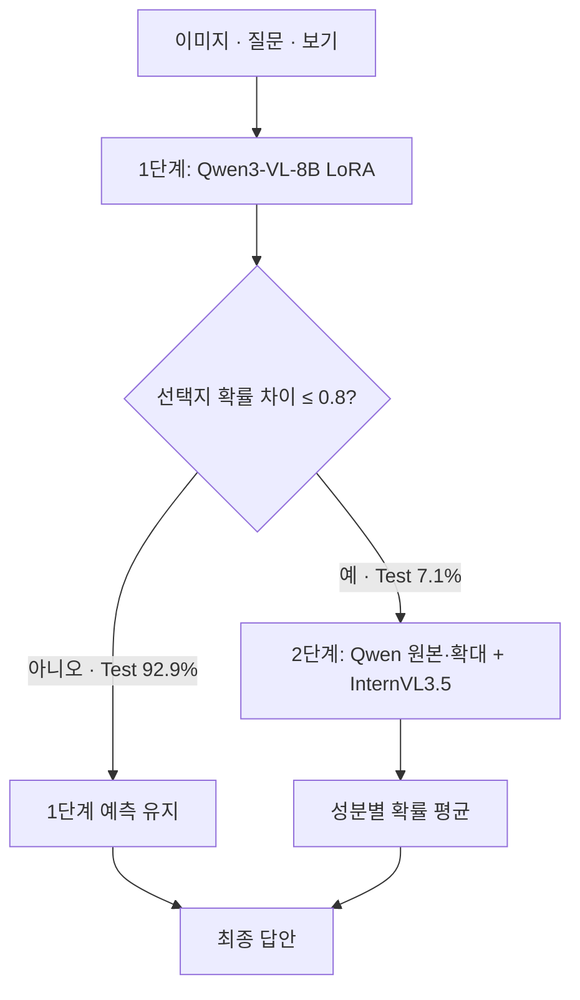
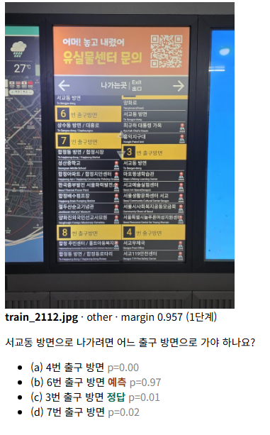
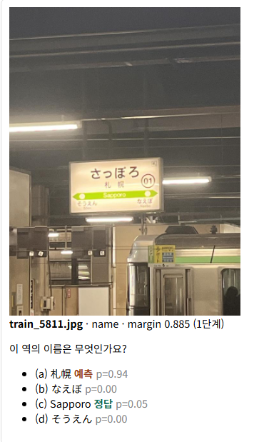
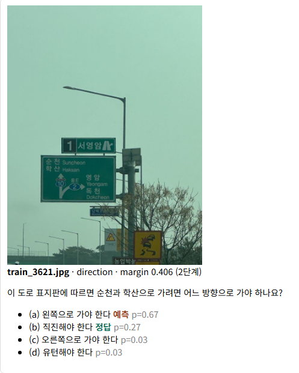
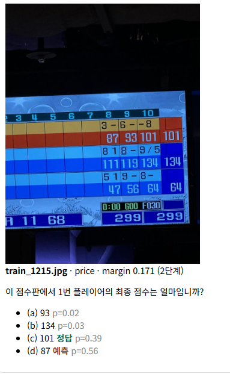
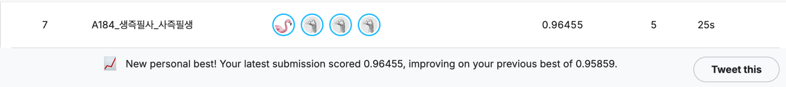
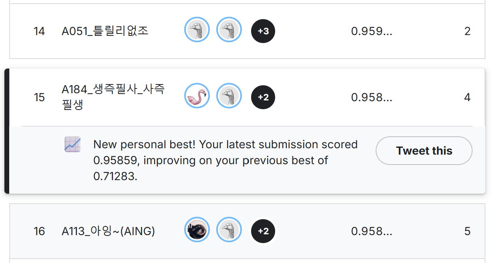

# SSAFY AI Challenge | 불확실한 문항에 계산을 집중하는 VQA

> A100 40GB 한 대에서, 전체 문항의 7.1%만 추가 추론해 리더보드 0.96514를 기록한 이미지 질의응답 프로젝트

간판·메뉴판·안내문 이미지와 한국어 질문을 입력받아 네 개의 보기 중 정답을 선택하는 VQA(Visual Question Answering) 파이프라인을 구축했습니다. 데이터와 오답을 분석해 추가 계산이 필요한 문항을 선별하고, 확대 이미지와 서로 다른 VLM의 예측을 결합했습니다. 모델 선정부터 검증 기준, 실패 실험, 재실행 가능한 추론 구조까지 기록했습니다.

| 핵심 결과 | 수치 | 측정 범위 |
| --- | --- | --- |
| 리더보드 개선 | 0.95859 → 0.96514, +0.655%p | 첫 제출 `sub_01` 대비 `sub_04` |
| 홀드아웃 개선 | 96.20% → 97.02%, +0.82%p | 고정 홀드아웃 1,343문항의 검증용 구성 |
| 홀드아웃 오답 감소 | 51개 → 40개, 약 21.6% 감소 | 같은 1,343문항에서 비교 |
| 선택적 추가 추론 | 6,714문항 중 475문항, 7.1% | Test의 나머지 92.9%는 1단계에서 종료 |

97.02%는 홀드아웃 성능이며 리더보드 점수와 구분합니다. 검증에는 홀드아웃을 학습하지 않은 어댑터만 사용했고, 실제 제출의 2단계에는 전체 Train으로 학습한 어댑터를 추가했습니다. 추가 추론 비율 7.1%는 대상 문항 비율이며, 전체 실행시간의 92.9% 단축을 의미하지 않습니다.

- 프로젝트: SSAFY AI 챌린지 / A184 '생즉필사 사즉필생' / 4인 팀
- 작성: 함형주 / 기록 기준: 2026.09.23
- 기술: Python, PyTorch, Transformers, PEFT/LoRA, pandas, NumPy, Pillow, Google Colab A100
- 모델: Qwen3-VL-8B-Instruct, InternVL3.5-8B / 양자화 비교 실험에 bitsandbytes 사용

## 1. 문제 정의: 어느 문항에 추가 계산을 써야 할까?

이미지에는 작은 글자, 한 자리만 다른 전화번호, 가격표, 화살표와 출구 안내처럼 세밀한 판독이 필요한 정보가 많았습니다. 평균 이미지 크기도 약 790×930으로, 입력을 일괄 축소하면 정답에 필요한 글자가 손실될 수 있었습니다.

해결해야 할 문제는 세 가지였습니다.

1. 이미지의 세부 정보를 보존하면서 A100 40GB 한 대에서 실행할 주력 모델을 선정한다.
2. 이미 잘 맞히는 문항의 예측을 유지하면서, 오답이 집중된 구간에 추가 계산을 배분한다.
3. 작은 점수 차이가 실제 개선인지 판단할 수 있도록 평가 조건과 비교 기준을 고정한다.

| 데이터 | 규모 | 사용 방식 |
| --- | --- | --- |
| Train | 6,714문항 | 질문 유형을 고려한 5-fold 분할, seed 42 고정 |
| Trainpart | 5,371문항 | 검증용 모델 학습 |
| Holdout | 1,343문항 | fold 0 고정, 주요 실험 비교 |
| Dev | 2,683문항 | 사람 간 합의가 어려웠던 문항 집합으로, 보조 검증에 사용 |
| Test | 6,714문항 | 제출용 추론 |

Dev는 일반 문항보다 어려운 사례가 모인 데이터였습니다. 주 성능 판단은 고정 홀드아웃에서 수행하고, Dev에서는 사람 3명 이상이 같은 답을 고른 문항을 활용해 어려운 사례에 대한 변화를 확인했습니다.

## 2. 최종 파이프라인

1단계는 Qwen3-VL-8B LoRA 모델로 전체 문항을 처리합니다. 보기 순서를 네 가지로 바꿔 추론한 뒤, 확률을 원래 보기 순서로 복원해 평균합니다. 가장 높은 두 선택지의 확률 차이인 `margin = p_top1 - p_top2`를 추가 추론 여부에 사용합니다.

`margin ≤ 0.8`인 문항은 Qwen의 원본·확대 이미지 예측과 InternVL3.5의 원본 이미지 예측을 결합합니다. 각 성분에서도 보기 순열 4회를 사용하며, 마지막에는 성분별 확률을 단순 평균합니다. InternVL을 호출하는 조건은 1단계 margin으로 결정됩니다.

| 구성 | 홀드아웃 검증 | 실제 Test 제출 |
| --- | --- | --- |
| 1단계 Qwen 어댑터 | `holdout_best` | `holdout_best` |
| 2단계 Qwen 어댑터 | `holdout_best` | `holdout_best` + `full_train` |
| 2단계 Qwen 이미지 | `orig` + `up1280` | `orig` + `up1280` |
| 보조 모델 | InternVL3.5 zero-shot / 원본 | 동일 |
| 추가 추론 임계값 | margin ≤ 0.8 | 동일 |
| 프롬프트 / OCR prior | 기본 프롬프트 / 미사용 | 동일 |

`up1280`은 입력의 최소 픽셀 수를 1280², 약 164만 픽셀로 높이는 확대 변형입니다. 모든 이미지를 1280×1280 정사각형으로 만드는 설정과는 다릅니다.

주력 모델 선정과 학습 설정

초기 zero-shot 300문항 비교에서 Qwen3-VL-8B는 정확도 96.33%, 문항당 약 0.14초를 기록했습니다. 같은 비교의 Qwen2.5-VL-7B는 94.33%, 약 0.25초였습니다. Qwen3.5-9B의 최고 조건은 96.67%로 한 문항 더 맞혔지만, 원본 조건에서는 8B보다 느리고 메모리 사용량과 추가 커널 의존성이 높았습니다. 주력 모델은 Qwen3-VL-8B로 정했습니다.

| 항목 | 설정 |
| --- | --- |
| 기본 정밀도 | bf16 |
| 학습 범위 | 비전 인코더 고정, 언어 모델에 LoRA 적용 |
| LoRA | r=16, alpha=32, dropout=0.05 |
| 학습 파라미터 | 약 4,365만 개 / 전체의 약 0.495% |
| 학습 | 1 epoch, learning rate 1e-4, cosine scheduler, warmup 5% |
| 메모리 대응 | gradient accumulation 8, 학습 이미지 최대 1024² 픽셀 |
| 목적 함수 | 마지막 위치의 A~D 점수에 대한 Choice Cross-Entropy |
| 추론 | 답안 생성 대신 선택지 로짓 비교, 보기 순열 TTA 4회 |

최종 출력이 네 보기 중 하나라는 평가 방식에 맞춰 학습 목적도 선택지 분류로 구성했습니다. 보기 순서를 섞어 학습하고, 추론에서는 순열별 확률을 원래 보기 위치로 복원했습니다.

전체 홀드아웃에서 순열 4회 조건을 맞춰 비교했을 때, zero-shot 95.23%에서 LoRA 적용 후 96.20%로 약 0.97%p 개선됐습니다. 이 비교는 아래 계단식 추론 개선과 별개의 학습 효과입니다.

## 3. 성능을 바꾼 판단과 근거

### 3.1 불확실한 6.6%의 문항에 오답의 절반 이상이 모여 있었다

추가 모델을 붙이기 전에, 1단계의 확신도 구간별 정확도를 확인했습니다.

| 1단계 예측 구간 | 홀드아웃 문항 수 | 구간 정확도 | 오답 수 |
| --- | --- | --- | --- |
| margin > 0.8 | 1,255개 / 93.4% | 98.33% | 21개 |
| margin ≤ 0.8 | 88개 / 6.6% | 65.91% | 30개 |

전체 51개 오답 중 30개가 88문항에 집중돼 있었습니다. 이 구간을 추가 추론 대상으로 삼으면 기존 고확신 예측을 보존하면서 오류가 많은 문항을 다시 평가할 수 있다고 판단했습니다.

기본 계단식 추론은 기존 오답 5개를 맞히고 정답 2개를 잃어, 순개선 +3문항을 기록했습니다. 반면 임계값을 0.8에서 0.95로 높여 대상을 88개에서 155개로 늘려도 정확도는 96.43%로 같았습니다. 이 결과를 바탕으로 후속 실험의 초점을 재추론 범위 확대에서 입력 이미지와 보조 모델 변경으로 옮겼습니다.

### 3.2 확대 이미지는 어려운 문항에 적용하고, 기존 정답의 손실도 확인했다

초기 해상도 실험에서는 전체 문항과 어려운 문항의 반응이 달랐습니다.

| Qwen3-VL-8B zero-shot 입력 | 홀드아웃 표본 300문항 | 어려운 Dev 표본 300문항 |
| --- | --- | --- |
| 축소 `cap768` | 94.00% | 63.33% |
| 원본 `native` | 96.33% | 67.33% |
| 확대 `up1280` | 95.00% | 68.33% |

확대는 홀드아웃 표본에서는 성능을 낮췄지만 어려운 Dev 표본에서는 개선 가능성을 보였습니다. 이를 가설로 삼아, 파인튜닝 모델의 불확실 문항에만 확대 이미지를 적용하는 E2 실험을 진행했습니다.

| E2 구성 | 임계값 | 홀드아웃 정확도 | 새로 맞힘 | 새로 틀림 | 순개선 |
| --- | --- | --- | --- | --- | --- |
| 기본 변형 + 확대 | 0.8 | 96.65% | 6 | 3 | +3 |
| 원본 + 확대 / 최종 채택 | 0.8 | 96.80% | 9 | 4 | +5 |
| 확대만 | 0.8 | 96.87% | 14 | 8 | +6 |
| 확대만 | 0.9 | 96.95% | 16 | 9 | +7 |

모두 기본 계단식 E0, 96.43% 대비 비교입니다. 기본 변형은 원본·밝기 조정·1.15배 확대입니다.

최종 제출에서는 원본+확대를 사용했습니다. 확대만 사용한 후보가 더 높은 정확도를 보였지만, 새로 틀린 문항도 8~9개로 늘었습니다. 원본+확대는 신규 오답을 4개로 제한하면서 +5문항을 확보했습니다. 관측 최고 정확도와 기존 정답 보존 사이의 절충을 선택한 것입니다.

### 3.3 보조 모델의 가치는 실제로 결합했을 때 확인했다

InternVL 계열은 Qwen보다 단독 정확도가 낮아도 Qwen의 오답 일부를 맞혔습니다. 단독 점수, Qwen 오답을 맞힌 수, 결합 후 순개선을 함께 비교했습니다.

| 보조 모델 | 단독 정확도 / 300문항 | Qwen 1단계 오답 51개 중 맞힌 수 | 결합 정확도 / 1,343문항 | 결합 순개선 |
| --- | --- | --- | --- | --- |
| InternVL3 | 90.33% | 22개 | 97.17% | 새로 맞힘 6 / 새로 틀림 1 / +5 |
| InternVL3.5 | 94.33% | 19개 | 97.02% | 새로 맞힘 5 / 새로 틀림 2 / +3 |

결합 순개선의 기준은 원본+확대 Qwen 구성, 96.80%입니다. 단독 평가는 300문항, 결합 평가는 1,343문항이므로 두 정확도를 직접적인 성능 상승폭으로 계산하지 않았습니다. Qwen 오답을 맞힌 19개·22개 역시 실제 최종 교정 수와 다릅니다.

최종 제출에는 InternVL3.5 zero-shot을 사용했습니다. InternVL3 결합의 97.17%는 별도 탐색에서 관측한 최고값으로 남겼습니다. 두 결과는 단독 정확도만으로 앙상블의 가치를 판단하기 어렵다는 점을 보여줍니다. 다만 이 기록만으로 InternVL3.5가 최적의 최종 선택이었다고 결론 내릴 수는 없습니다.

적용 범위도 검증했습니다. InternVL3.5 예측을 최종 검증판 전체 문항에 30% 비중으로 추가 혼합하면, 4개를 고치는 동안 9개를 새로 틀려 순개선 -5가 됐습니다. 이 결과는 불확실 문항에 한정한 결합을 유지하는 근거가 됐습니다.

### 3.4 오답 이미지에서 다음 실험의 가설을 찾았다

문항별 이미지·질문·보기·예측 확률을 함께 확인하며, 글자 판독뿐 아니라 배치 관계와 정답 기준도 분석했습니다. 아래는 당시 오답 분석 화면입니다. 정답은 데이터에 기록된 라벨이며, 원인 설명은 이미지와 예측을 대조한 가설입니다.

| 안내판의 제목과 항목 연결 | 같은 역명의 표기 차이 |
| --- | --- |
|  |  |
| `train_2112` / 1단계 margin 0.957. 모델은 6번 출구를 선택했지만 데이터 정답은 3번 출구입니다. 높은 확신에도 제목과 목적지의 소속 관계를 잘못 연결할 수 있음을 보여줍니다. | `train_5811` / 1단계 margin 0.885. 모델이 고른 `札幌`와 정답 `Sapporo`는 같은 역을 가리킵니다. 의미가 겹치는 보기의 정답 기준을 검토할 필요가 있는 사례입니다. |

| 도로 표지판의 화살표 해석 | 점수판의 행·열과 최종값 선택 |
| --- | --- |
|  |  |
| `train_3621` / 2단계 margin 0.406. 왼쪽을 선택했지만 데이터 정답은 직진입니다. 목적지 글자의 위치와 화살표가 가리키는 방향을 구분하는 구조 해석이 필요합니다. | `train_1215` / 2단계 margin 0.171. 1번 플레이어의 최종 점수 101 대신 중간 점수 87을 선택했습니다. 숫자 인식과 함께 플레이어·프레임·최종 점수의 대응 관계를 판단해야 합니다. |

이 사례들은 서로 다른 후속 판단으로 연결됐습니다.

- 안내판·화살표: 방향과 제목의 소속 관계를 설명하는 구조 힌트를 실험했습니다. 홀드아웃 부분집합에서는 +2였지만 Dev 45문항에서 Net 0이어서 최종 적용을 보류했습니다.
- 세부 글자·숫자: 확대 이미지와 다른 VLM을 결합하는 실험에서 전체 홀드아웃의 순개선을 확인했습니다. 다만 위 점수판 문항까지 교정됐다는 기록은 없어, 개별 사례의 해결을 성과로 주장하지 않습니다.
- 의미가 겹치는 보기: 라벨 검토 후보로 분류했습니다. 모델 예측이 다르다는 이유만으로 정답을 바꾸지는 않았습니다.

특히 첫 번째 사례는 margin 0.8을 넘기 때문에 현재의 추가 추론 조건으로 잡히지 않습니다. 마지막 두 사례는 화면에 2단계 결과로 표시돼 있어, 추가 추론 뒤에도 남을 수 있는 구조·숫자 해석 문제를 보여줍니다. 이 화면들은 오류 분석 당시의 결과로, 최종 제출 구성의 잔여 오답 목록과 동일하다고 가정하지 않았습니다.

## 4. 실패 실험에서 바꾼 판단

실험마다 `Fixed = 기존 오답을 새로 맞힌 수`, `Broken = 기존 정답을 새로 틀린 수`, `Net = Fixed - Broken`을 기록했습니다. Net은 정확도 차이를 문항 단위로 풀어 쓴 값입니다. Fixed와 Broken을 함께 보면 같은 순개선에서도 예측이 얼마나 크게 바뀌었는지 확인할 수 있습니다.

| 시도와 가설 | 관측 결과 | 판단과 반영 |
| --- | --- | --- |
| Qwen을 2 epoch 학습하면 개선될 것이다 | 약 138분 학습. 중간 300문항 최고 96.67%였지만 전체 홀드아웃에서 1단계 96.20% → 95.90%, Net -4 | 전체 평가를 기준으로 기각, 1 epoch 유지 |
| InternVL3.5도 파인튜닝하면 결합 성능이 높아질 것이다 | 약 192분 학습. Qwen 원본+확대 대비 +1, 결합 96.87%. zero-shot 결합은 +3, 97.02% | 학습 비용과 결합 이득을 비교해 zero-shot 유지 |
| 다른 seed의 Qwen을 평균하면 안정적일 것이다 | 기존 모델+seed 7 평균이 기존 1단계 대비 Net -2 | seed 다양성만으로는 개선되지 않아 기각 |
| 합의된 Dev 데이터를 더 학습하면 개선될 것이다 | 1,074개 추가. 같은 seed의 기존 모델 대비 seed 42는 +2, seed 7은 -1 | 두 seed 모두 개선되지 않아 기각 |
| 학습 데이터를 달리한 4개 모델을 결합하면 개선될 것이다 | 4모델×순열 1회는 기존 1모델×4회 대비 +3. 4모델×4회는 +2 | 동일 추론 횟수 비교에서도 사전 채택 기준 +8에 미달 |
| 확신도 조건으로 답을 교체하면 단순 평균보다 나을 것이다 | 같은 성분을 사용해 새로 맞힘 1 / 새로 틀림 9 / Net -8 | 교체 규칙을 기각하고 단순 평균 유지 |

표의 Net은 각 행에 적힌 비교 기준에 대한 값이며, 서로 다른 실험의 Net을 합산하지 않습니다.

두 가지 판단 기준이 달라졌습니다. 먼저 학습 중 작은 표본의 최고점보다 전체 홀드아웃 결과를 우선했습니다. 또한 seed 7 모델에서 기존 모델 대비 5문항의 차이가 관측된 뒤에는, 일부 후속 학습 실험에 두 seed 모두 개선하고 합계 +8 이상이어야 한다는 더 엄격한 기준을 적용했습니다. 이는 실험 채택 규칙이며 통계적 유의성 검정은 아닙니다.

프롬프트·이미지 전처리의 추가 기각 기록

- 유형 힌트 제거: 파인튜닝 모델에서 Net +2로 초기 채택 기준 +3에 미달했습니다.
- 부정형 질문 경고: Net 0이었습니다. 해당 질문은 기존에도 31개 중 30개를 맞혔습니다.
- 눈에 띄는 글자 우선 힌트: zero-shot에서는 +3, 파인튜닝 모델에서는 -2였습니다. 실제 배포할 모델 상태에서 판단해 기본 프롬프트를 유지했습니다.
- 구조 읽기 힌트: 방향·출구 관련 홀드아웃 부분집합에서는 +2였지만, Dev 45문항에서는 새로 맞힘 2 / 새로 틀림 2로 Net 0이었습니다.
- 3B 보조 모델·CLAHE 대비 강화: 최종 검증판에 추가한 네 후보가 모두 Net -2~-3으로 악화돼 제외했습니다.

## 5. 실험을 믿을 수 있게 만든 구현

### 설정값과 실제 입력이 다른 문제를 찾아 수정

초기 해상도 실험에서 서로 다른 픽셀 제한을 설정했는데도 정확도·시간·메모리가 동일하게 나왔습니다. 이미지 프로세서의 설정이 실제 입력에 반영되지 않는 문제를 확인하고, PIL로 이미지를 직접 리사이즈한 뒤 패치 수로 적용 여부를 점검했습니다. 이전 결과도 해상도별 비교에서 원본 해상도 모델 비교로 해석을 수정했습니다.

32B 모델 실험에서도 설정과 실제 레이어 상태를 대조했습니다. 비전 인코더를 양자화에서 제외하려 했지만 일부 레이어가 4비트로 남아 있었습니다. 실제 모듈의 전체 이름을 추출해 제외 목록에 전달한 뒤 비전 파라미터가 bf16인지 확인했습니다. 300문항 정확도는 93.67%에서 94.33%로 회복됐지만, 8B 기준 96.33%에 미치지 못해 채택하지 않았습니다. 이는 해당 양자화 조건에서의 결과입니다.

### 중단 후에도 이어서 비교할 수 있도록 결과를 분리 저장

| 구현 | 해결한 문제 |
| --- | --- |
| `(문항 ID, 모델/어댑터, 이미지 변형)`별 확률 저장 | 이미 계산한 성분으로 임계값·조합을 다시 비교할 수 있게 구성 |
| 2단계 추론 결과를 20문항마다 저장 | 런타임 중단 후 저장 완료된 조합을 건너뛰고 미완료 계산 재개 |
| 실험별 파일명과 모델별 `source` 구분 | 서로 다른 모델·설정의 예측이 섞이는 위험을 줄임 |
| `experiments.jsonl`에 결과와 설정 기록 | 실험마다 기록 항목이 달라 발생하던 CSV 열 불일치 해결 |
| 고정 fold와 검증용·제출용 어댑터 분리 | 전체 Train으로 학습한 `full_train`이 홀드아웃 평가에 들어가지 않게 구분 |
| 최종 제출 CSV와 설정 JSON 저장 | 제출 답안과 적용한 모델·변형·임계값을 함께 추적 |

관련 구현은 실험 노트북의 `run_components`, `cascade`, `score`, `assemble_test`, `log_exp`에 나누어 구성했습니다. GPU 추론과 확률 조합을 분리해, 저장된 성분의 조합 비교는 추가 모델 추론 없이 수행했습니다.

### 검증 규모와 중복 기준을 명시

초기 zero-shot 정확도는 300문항에서 96.33%였지만 전체 홀드아웃에서는 94.04%였습니다. 이후 주요 판단을 1,343문항 전체로 옮겼습니다. 전체 홀드아웃에서 한 문항은 약 0.074%p이므로, 정확도와 함께 바뀐 문항 수를 남겼습니다.

이미지 파일 해시와 정규화한 질문·보기를 이용한 중복 검사도 수행했습니다. Train-Test 간 동일 이미지는 24건, 이미지와 질문이 같은 경우는 1건, 이미지·질문·보기가 모두 같은 경우는 0건이었습니다. Trainpart-Holdout 간 완전 동일 문항도 0건이었습니다. 이 검사는 완전 중복 확인이며 유사 이미지나 의미상 중복까지 배제하는 검사는 아닙니다.

## 6. 제출 결과

| 제출 | 변경 내용 | 리더보드 점수 | 직전 제출 대비 |
| --- | --- | --- | --- |
| `sub_01` | Qwen LoRA / 보기 순열 4회 / 1단계 | 0.95859 | - |
| `sub_02` | 불확실 475문항에 계단식 추론 적용 | 0.96455 | +0.596%p |
| `sub_03` | 2단계 Qwen 이미지 변형을 원본+확대로 변경 | 0.96484 | +0.029%p |
| `sub_04` | 2단계에 InternVL3.5 zero-shot 추가 | 0.96514 | +0.030%p |

제출 이력에서 가장 큰 상승은 계단식 구조를 도입한 `sub_02`에서 발생했습니다. 다만 이 제출은 추가 이미지 변형과 `full_train` 어댑터도 함께 도입했으므로, +0.596%p 전부를 문항 선별만의 효과로 해석하지 않습니다. 홀드아웃에서는 구성별 비교를 통해 기본 재추론, 해상도, 보조 모델의 기여를 따로 확인했습니다.

### 리더보드에서 확인한 개선

계단식 추론 도입 후 점수 0.96455와 이전 점수 0.95859를 함께 확인할 수 있는 화면입니다. 두 캡처에서 팀 순위는 15위에서 7위로 바뀌었습니다. 순위는 각 화면 촬영 시점의 공개 리더보드 기준입니다.

이후 `sub_04` 점수 0.96514는 실험 보고서에 기록된 값입니다. 위 캡처는 `sub_02` 단계의 근거이며, 최종 점수나 최종 대회 순위를 나타내는 화면은 아닙니다.

비교 기준: 계단식 추론 도입 전 리더보드 / 0.95859

화면에 표시된 0.71283은 그보다 앞선 개인 최고점입니다. 이 문서의 개선 폭은 비교 구성이 확인되는 `sub_01`의 0.95859를 기준으로 계산했습니다.

## 7. 남은 한계와 다음 검증

- 고확신 오답: 1단계에서 margin이 0.8보다 높은데도 틀린 문항이 21개 남았습니다. 방향·출구 안내의 구조를 잘못 읽으면서 확신하는 사례가 있어, margin만으로 모든 오류를 찾을 수는 없습니다. 후속 과제는 구조 질문 여부나 모델 간 불일치를 추가 선별 신호로 검증하는 것입니다.
- 반복 검증의 선택 편향: 같은 홀드아웃에서 여러 후보를 비교했습니다. +1~+3문항의 차이를 일반화된 성능 향상으로 단정하기 어려우며, 다음 단계에서는 별도 검증 분할에서 설정을 고정한 재평가가 필요합니다.
- 최종 모델 선택 근거: InternVL3 결합이 더 높은 탐색 점수를 보였지만 실제 제출은 InternVL3.5였습니다. 독립 검증에서 오류 상보성과 성능을 다시 비교해 선택 근거를 보강할 필요가 있습니다.
- 미완료 후보: OCR 텍스트 주입·박스 크기/위치 prior·stitched crop은 유효한 성능 결과가 확보되지 않아 최종 구성에서 제외했습니다.

이 프로젝트를 통해 데이터의 특성에서 가설을 세우고, 실제 입력과 실행 상태를 검증하며, 새로 맞힌 문항과 새로 틀린 문항을 함께 측정하는 실험 절차를 구축했습니다. 추가 계산을 어디에 배분할지 결정하고, 채택할 개선과 중단할 실험을 근거로 구분한 것이 핵심 경험입니다.

근거 자료와 수치 해석

| 근거 자료 | 확인한 내용 |
| --- | --- |
| `experiments(4).ipynb` | E0/E1/E2/P/E5/E6/E7, seed·Dev·inner-fold·혼합 실험의 저장 출력과 최종 조립 코드 |
| `AI챌린지_실험보고서(2).pdf` | EDA, 초기 모델·해상도 비교, 학습 설정, 리더보드 제출 이력, 엔지니어링 이슈 |
| `AI_Challenge_VLM_Experiment_Report(1).pdf` | 실험별 비교, 관측 최고값과 최종 구성 구분, 실패 실험 분석 |
| HTML 보고서·10페이지 발표자료 | 프로젝트 개요와 발표 흐름 |
| 리더보드 캡처 2장 | 0.95859 → 0.96455의 개선 및 각 촬영 시점의 공개 순위 |
| 오답 분석 캡처 4장 | 문항별 이미지·예측·정답 라벨·margin과 구조/표기/숫자 오류 사례 |

실험의 완료 여부와 수치가 자료마다 다른 경우에는 제공된 노트북의 저장된 실행 결과를 우선했습니다. 예를 들어 inner-fold 실험은 이전 보고서에서 진행 중이었지만 노트북에는 완료 및 기각 결과가 남아 있습니다. InternVL3.5 추가 학습 시간은 저장 로그의 약 192분을 사용했습니다.

홀드아웃 정확도는 기록된 소수 넷째 자리 값을 백분율로 표기했으며, 51→40개 오답 감소는 1,343문항의 정답 수에 대응합니다. 97.17%는 탐색 후보의 홀드아웃 최고값, 97.02%는 최종 제출에 대응하는 검증용 구성, 0.96514는 보고서에 기록된 리더보드 점수입니다.

